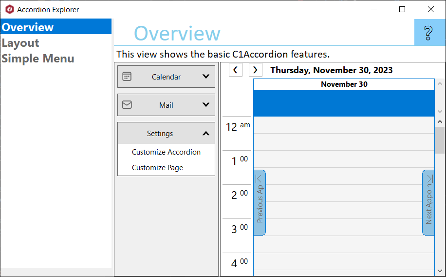

## AccordionExplorer
#### [Download as zip](https://grapecity.github.io/DownGit/#/home?url=https://github.com/GrapeCity/ComponentOne-WinForms-Samples/tree/master/Core\Accordion\CS\AccordionExplorer)
____
#### Shows all the features of Accordion control.
____
AccordionExplorer is the single source for you to learn about Accordion. 
It shows all the features of Accordion in an easy to explore hierarchy.

Included samples:

* Overview.
  This view shows the basic Accordion features.

* Layout.
  This view shows different Layout options for C1Accordion control.

* SimpleMenu.
  This view shows how to use C1Accordion control to create simple Hamburger menu.

