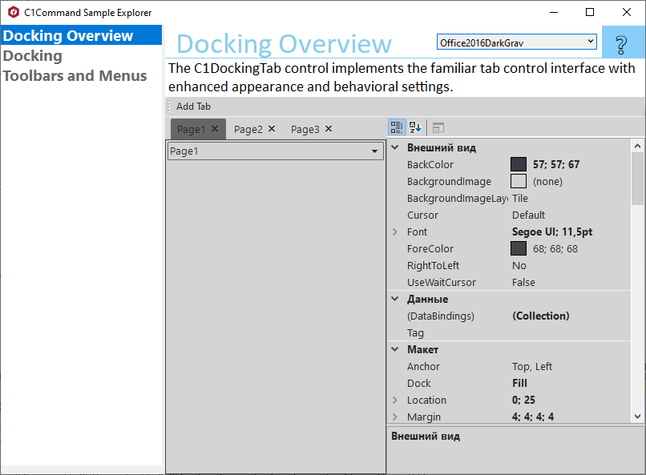

## CommandExplorer
#### [Download as zip](https://minhaskamal.github.io/DownGit/#/home?url=https://github.com/GrapeCity/ComponentOne-WinForms-Samples/tree/master/Core/Command/CS/CommandExplorer)
#### Shows main samples of controls in the C1.Win.Command assembly.
____
Included samples:
  
* DockingOverview - shows all common properties for C1DockingTab and allows to change them at runtime via PropertyGrid control.
  The C1DockingTab control implements the familiar tab control interface but it also includes a variety of features to visually enhance and customize the control. 
  In addition to the appearance properties, C1DockingTab has several useful behavioral properties for closing tab pages, rearranging tabs, and auto-hiding capabilities.
* Docking - shows how to create workspaces from floating and docking tabs. C1DockingTabs can float and dock to any edge of the application. 
  C1DockingTabs can float and dock to any edge of the application. Choose among four different docking styles, including Visual Studio 2012 style. 
  To undock and float a C1DockingTab, position your mouse over the tab or the caption bar. Then, click and drag to undock. 
  When dragging tabs near the edges of the form you will notice docking rectangles appear signaling where to dock. 
  In addition, C1DockingTab supports auto-hiding functionality where tabs can be minimized to slide in and out.
* ToolbarsOverview - shows C1Menu, C1ContextMenu and C1Toolbar which share the same set of commands.
  Menus and Toolbars is a suite of controls including C1MainMenu, C1ContextMenu, and C1ToolBar. 
  The menus and toolbar components can share commands, meaning you will have a cleaner UI and less code to manage. 
  Other features include embedding arbitrary controls, run-time toolbar customization and more.

