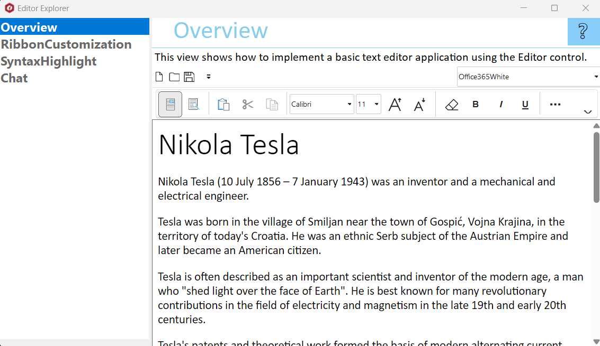

## EditorExplorer
#### [Download as zip](https://grapecity.github.io/DownGit/#/home?url=https://github.com/GrapeCity/ComponentOne-WinForms-Samples/tree/master/Core\Editor\CS\EditorExplorer)
____
#### Shows all the features of Editor control.
____
EditorExplorer is the single source for you to learn about Editor. 
It shows all the features of Editor in an easy to explore hierarchy.

Included samples:

* Overview.
  This view shows how to implement a basic text editor application using the Editor control.

* Ribbon Customization.
  This view shows customization feature of C1EditorRibbon. Use all the features available for C1Ribbon to customize C1EditorRibbon, such as showing/hiding/adding/removing items or saving/loading layout, etc.

