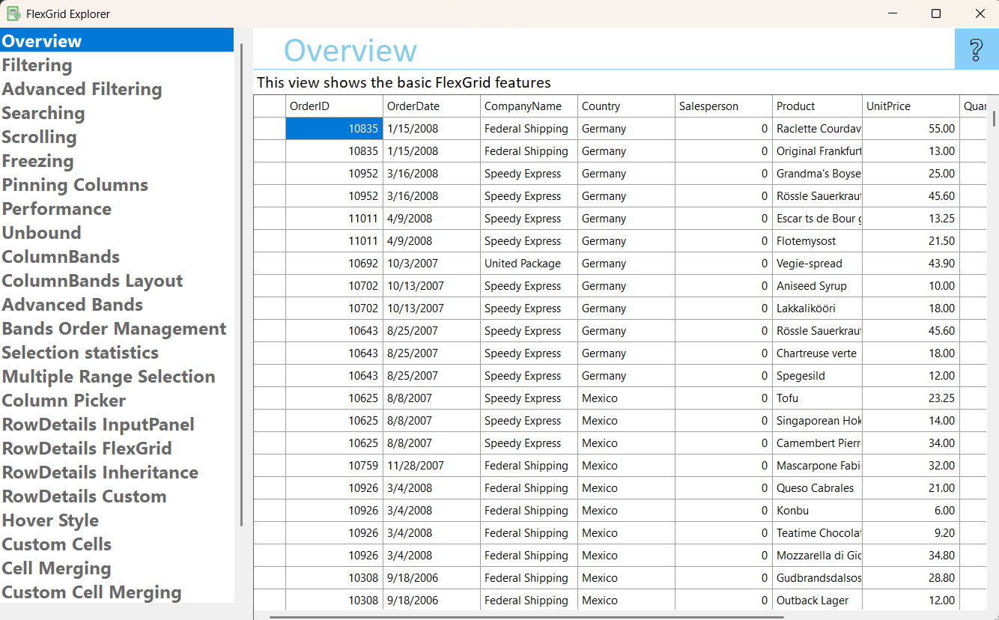

## FlexGridExplorer
#### [Download as zip](https://grapecity.github.io/DownGit/#/home?url=https://github.com/GrapeCity/ComponentOne-WinForms-Samples/tree/master/Core\FlexGrid\CS\FlexGridExplorer)
____
#### Shows all the features of FlexGrid control.
____
FlexGridExplorer is the single source for you to learn about FlexGrid. 
It shows all the features of FlexGrid in an easy to explore hierarchy.
 
#### Included Samples

* **Home**  
* **Introduction**
* **What's New**
    * Transposed Grid
    * Virtual Scrolling
* **Features**
  * **Cells**
    * Cell Merging
    * Custom Cell Merging
    * Custom Cells
    * Hover Style
    * Selection
    * Selection Statistics
  * **Columns**
    * Column Footers
    * Column Picker
    * Column Pinning
    * Column Sizing
    * Freezing
    * Sparklines
    * Transposed Grid 
  * **Column Bands**
    * Column Bands
    * Column Bands Layout
    * Multi-Row Bands
    * Order Management
  * **Editing**
    * Column Editors
    * Unbound
    * Validation
  * **Filtering**
    * Filtering
    * Filtering by Inheritance
    * Search Panel
  * **Hierarchical**
    * Grouping
    * Grouping Panel
    * Subtotals
    * Tree Grid
  * **Performance**
    * Loading Data
    * Scrolling
    * irtual Scrolling
  * **Printing and Export**
    * Export and Print
    * Export to PDF 
  * **Row Details**
    * Basic Row Details
    * Custom Row Details
    * Input Panel
    * Nested Grid

## Project Structure

- **Component/** – The Component folder contains the User Controls for Sidebar navigation, Search input and Tile cards
- **Core/** – CContains the foundational logic and interfaces that power the FlexGridExplorer application
- **Data/** – Contains classes responsible for managing and accessing data sources used by FlexGridExplorer
- **Model/** – Contains data model classes that define the XML-driven structure used by FlexGridExplorer
- **Resources/** – Includes localized UI strings and embedded resources
- **Samples/** –The Samples folder contains FlexGrid samples which are User Controls
- **Utility/** – The Utility folder contains general-purpose reusable components that provide shared functionality across the application
 
## UML Call Hierarchy Overview

The following UML-style call hierarchy illustrates how major components in the **FlexGridExplorer** project interact at runtime.   
```
Form1
├─ _sampleLoader.LoadSamples()
│  └─ SampleLoader.LoadSamples()
│     └─ SampleManager.ItemCollection.Items (via SampleManager)
│
├─ sideBar1.Samples = _samples
│  └─ SideBar.Samples { set; }
│     └─ SideBar.PrepareSideBar()  // invoked internally when samples are assigned
│
├─ sideBar1.SelectionChanged += OnSideBarSelectionChanged
│  └─ SideBar.SelectionChanged (public event)
│     └─ Raised when user selects a new sample
│
├─ _navigator.ShowSample(ItemInfo sample)
│  └─ SampleNavigator.ShowSample()
│     └─ SampleViewer.LoadSample()
│
└─ _navigator.ShowTiles(ItemInfo sample)
   └─ SampleNavigator.ShowTiles()
      ├─ TileGroup.Tiles.Add()
      ├─ TileControl.Groups.Add()
      └─ SampleNavigator.UpdateImages()

```

