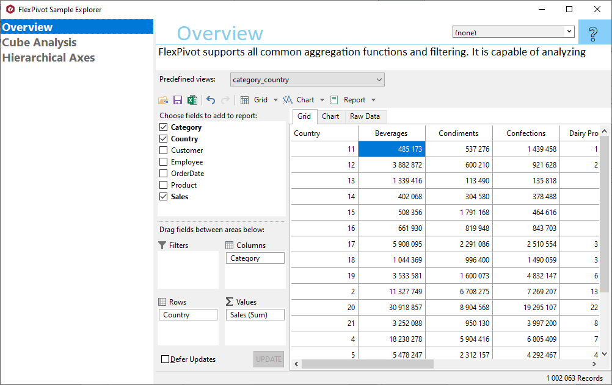

## FlexPivotExplorer
#### [Download as zip](https://grapecity.github.io/DownGit/#/home?url=https://github.com/GrapeCity/ComponentOne-WinForms-Samples/tree/master/Core\FlexPivot\CS\FlexPivotExplorer)
____
#### Shows main samples of controls in the C1.Win.FlexPivot assembly.
____
Included samples:

* Overview. Performs analytics on sales data.
  FlexPivot supports all common aggregation functions and filtering. It is capable of analyzing large data sets with millions of records in seconds or less. 
  The user can specify what kinds of analytics to perform, and see the results in different views including a pivot grid and a chart.

* Cube Analysis. Shows how to use C1FlexPivot to analyze Cube data.
* Hierarchical Axes. Shows how to enable hierarchical view for chart axes using ShowHierarchicalAxes property.

