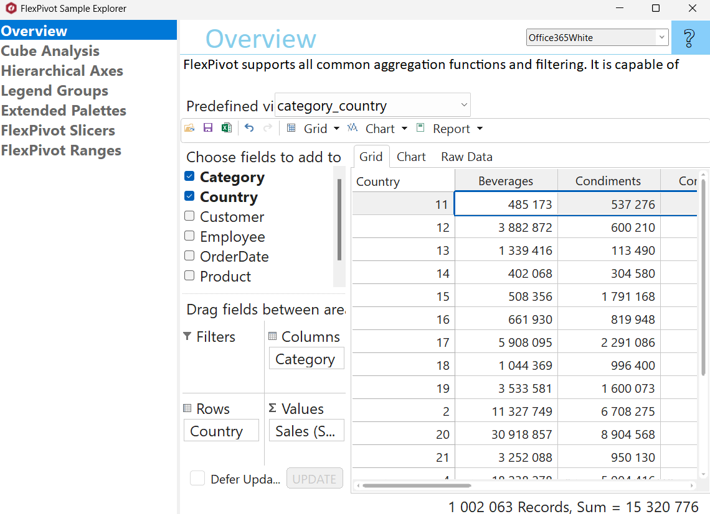

## FlexPivotExplorer
#### [Download as zip](https://grapecity.github.io/DownGit/#/home?url=https://github.com/GrapeCity/ComponentOne-WinForms-Samples/tree/master/Core\FlexPivot\CS\FlexPivotExplorer)
____
#### Shows main samples of controls in the C1.Win.FlexPivot assembly.
____
Included samples:

* Overview. Performs analytics on sales data.
  FlexPivot supports all common aggregation functions and filtering. It is capable of analyzing large data sets with millions of records in seconds or less. 
  The user can specify what kinds of analytics to perform, and see the results in different views including a pivot grid and a chart.
* Cube Analysis. Shows how to use C1FlexPivot to analyze Cube data.
* Hierarchical Axes. Shows how to enable hierarchical view for chart axes using ShowHierarchicalAxes property.
* Legend Groups. Shows how to enable items grouping for chart legend using LegendGroups property.
* Extended Palettes. Add a set of extended palettes to the default PivotChart's context menu.
* FlexPivotSlicers
  Demonstrates how to use C1FlexPivotSlicer control to setup FlexPivot filters.
  The sample represents a form with a C1Ribbon on the top. The ribbon contains a gallery of views available. When a user selects a view, the view is shown on the right in form of a C1FlexPivotGrid or a C1FlexPivotChart. On the left, in a dashboard layout (C1DashboardLayout) a list of available for filtering fields is shown. User can select check/uncheck the fields in the list. The panels with the C1FlexPivotSlicer control inside are shown in on the left.
* FlexPivotRanges
  Grouping data in Ranges. This project shows how to group data in ranges. There is a set of range examples in the ribbon gallery. The ranges are set for both Row and Column fields. "Year, Month" and "Alphabetical" ranges are nested.

