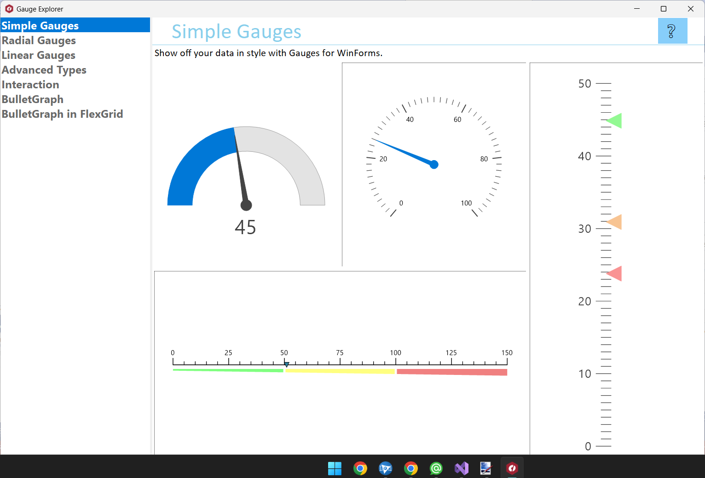

## GaugeExplorer
#### [Download as zip](https://grapecity.github.io/DownGit/#/home?url=https://github.com/GrapeCity/ComponentOne-WinForms-Samples/tree/master/Core\Gauge\CS\GaugeExplorer)
____
#### Shows all the features of Gauge control.
____
GaugeExplorer is the single source for you to learn about Gauge. 
It shows all the features of Gauge in an easy to explore hierarchy.

Included samples:

* Simple Gauges.
  Shows some basic gauge templates. Show off your data in style with Gauges for WinForms.

* Radial Gauges.
  Shows some examples of radial gauge templates. Create circular, helical, half-circular, rectangular and clamshell shaped radial gauges. Add numeric counters, state indicators, ranges, multiple pointers, scales, labels, images and more.

* Linear Gauges.
  Shows some examples of linear gauge templates. Create rulers, progress bars, thermometers and more with linear gauges. Represent data values with pointers and moving ranges.

* Advanced Types.
  Shows some examples of advanced gauge templates. Create advanced gauges where the scale sweeps more than 360 degrees or rotates around a stationary pointer.

* Interaction.
  This demo shows common interaction features. Users can now interact with the C1RadialGauge and C1LinearGauges. Use Gauges for WinForms for unique input by allowing users to drag the pointers like a knob. The gauge pointers can even snap to specific intervals. You can also create custom buttons with specific styles for each state (over, pressed, normal, etc) and use them throughout the gauge controls.

* BulletGraph.
  This demo shows basic C1BulletGraph features. BulletGraph is a type of linear gauge designed specifically for use in dashboards and information screens. It displays a single key measure along with a comparative measure and qualitative ranges to instantly signal whether the measure is good, bad, or in some other state.

* BulletGraph in FlexGrid.
  This demo shows how to use BulletGraph in FlexGrid. BulletGraph can be used in FlexGrid to draw it in a cell.

