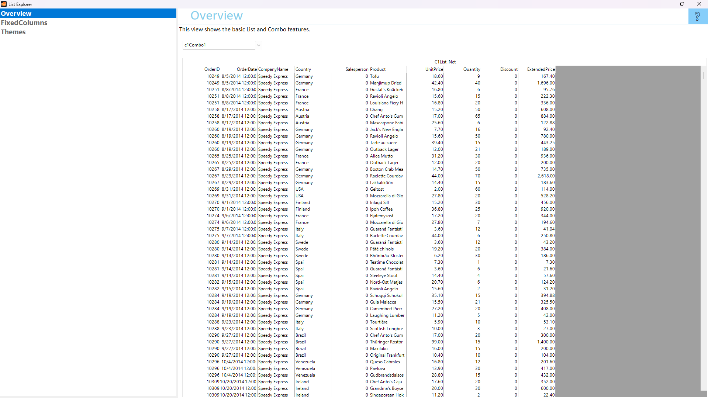

## ListExplorer
#### [Download as zip](https://grapecity.github.io/DownGit/#/home?url=https://github.com/GrapeCity/ComponentOne-WinForms-Samples/tree/master/Core\List\CS\ListExplorer)
____
#### Shows features of List and Combo controls.
____
ListExplorer is the single source for you to learn about List and Combo.
It shows features of List and Combo in an easy to explore hierarchy.

Included samples:

* Overview.
  This view shows the basic List and Combo features.

* FixedColumns.
  This view shows the List with fixed columns.

* Themes.
  This view shows appearance of List and Combo with the applied C1Theme.

