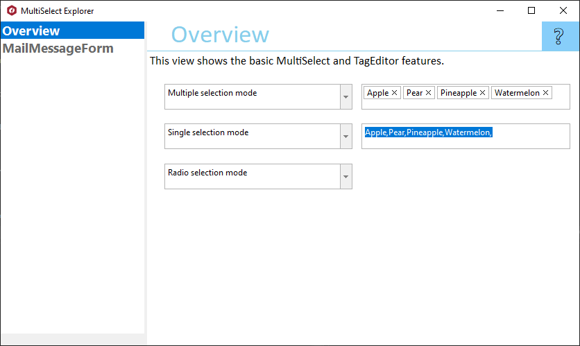

## MultiSelectExplorer
#### [Download as zip](https://grapecity.github.io/DownGit/#/home?url=https://github.com/GrapeCity/ComponentOne-WinForms-Samples/tree/master/Core\MultiSelect\CS\MultiSelectExplorer)
____
#### Shows features of C1MultiSelect and C1TagEditor controls.
____
MultiSelectExplorer is the single source for you to learn about C1MultiSelect and C1TagEditor.
It shows features of C1MultiSelect and C1TagEditor in an easy to explore hierarchy.

Included samples:

* Overview.
  This view shows the basic MultiSelect and TagEditor features.
  The C1MultiSelect supports multiple selection modes. C1TagEditor and C1MultiSelect support two display modes.

* MailMessageForm.
  This sample illustrates one case of using C1MultiSelect and C1TagEditor controls.
  The C1MultiSelect control can be used as "To" and "Cc" editor of mailing "New message" form.
  Besides C1TagEditor is used to add tags to the message.
  Tags can be used to finding necessary messages in mailing application.

