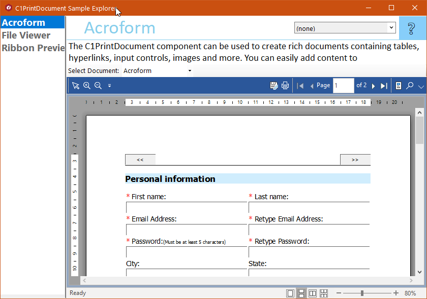

## PrintDocExplorer
#### [Download as zip](https://grapecity.github.io/DownGit/#/home?url=https://github.com/GrapeCity/ComponentOne-WinForms-Samples/tree/master/Core\PrintDocument\CS\PrintDocExplorer)
____
#### Shows main samples of controls and components in the C1.PrintDocument, C1.Win.PrintPreview and C1.Win.RibbonPreview assemblies.
____
Included samples:

* Acroform.
  The C1PrintDocument component can be used to create rich documents containing tables, hyperlinks, input controls, images and more. 
  You can easily add content to C1PrintDocument with its block, inline and direct rendering methods, and then print or export to PDF, 
  Word, Excel and more. This demo features interactive objects in the document (Acroforms). 
  Use 'Save File' button to save generated form into PDF. 

* File Viewer.
  C1 PrintPreview controls can display both C1PrintDocument and Microsoft's PrintDocument content. 
  This demo shows how to create simple file viewer for txt files using C1PrintPreviewControl and System.Drawing.Printing.PrintDocument 
  or C1PrintDocument components. Try to open the same file with PrintDocument and C1PrintDocument to see how easy 
  it is to get paging and word wrapping if C1PrintDocument does it for you.

* Ribbon Preview.
  The sample creates a C1PrintDocument, in which most of the RenderObject types are included: RenderArea, RenderText, RenderGraphics, RenderEmpty, 
  RenderImage, RenderRichText, RenderPolygon, RenderTable, RenderParagraph.
  New RibbonPreview control allows you to get more screen place by using Ribbon Simplified view or by minimizing Ribbon.
  New icon set is customized both for light and dark themes.

