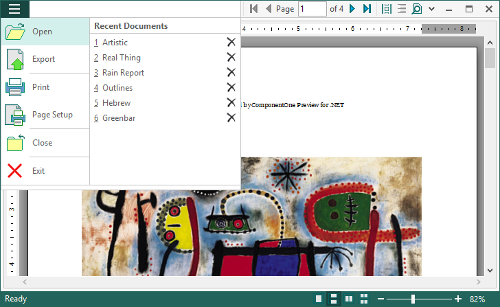

## RibbonPreviewControlDemo
#### [Download as zip](https://grapecity.github.io/DownGit/#/home?url=https://github.com/GrapeCity/ComponentOne-WinForms-Samples/tree/master/Core\PrintDocument\CS\RibbonPreviewControlDemo)
____
#### Implements a viewer utility for .c1dx/.c1d files based on C1RibbonPreview control
____
The sample configures a RibbonApplicationMenu in C1RibbonPreview with the frequently used actions and the Recent Documents list.
You can pin this application to the TaskBar and use Jump List items to open Recent Documents quickly.

