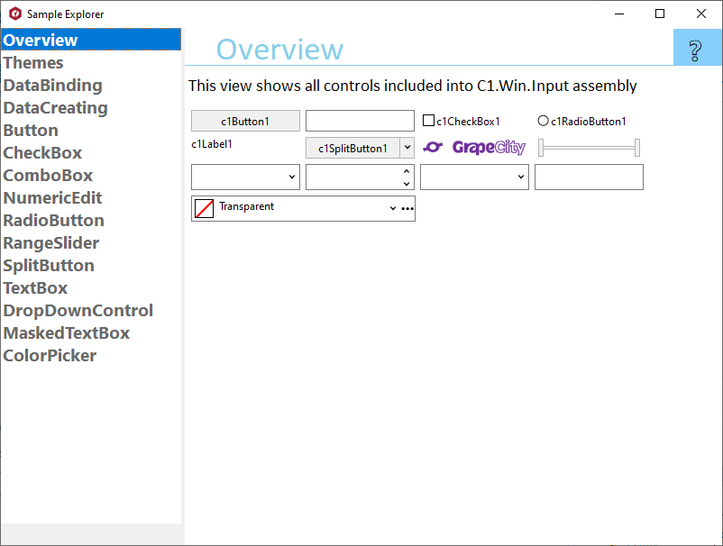

## InputExplorer
#### [Download as zip](https://grapecity.github.io/DownGit/#/home?url=https://github.com/GrapeCity/ComponentOne-WinForms-Samples/tree/master/Core\Input\CS\InputExplorer)
____
#### Shows main samples of controls in the C1.Win.Input assembly.
____
Shows the following controls:

* C1Button
* C1CheckBox
* C1ComboBox
* C1DropDownControl
* C1NumericEdit
* C1RadioButton
* C1RangeSlider
* C1SplitButton
* C1TextBox
* C1PictureBox
* C1MaskedTextBox
* C1ColorPicker

Other included samples:

* DataBinding. Shows how to use data binding to implement input form.
* Overview. Shows the default appearance of all controls on the single page.
* Themes. Shows how controls look with different C1Themes applied.
