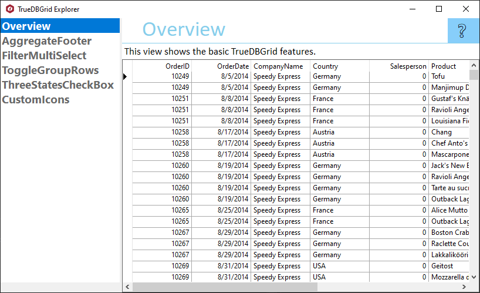

## TrueDBGridExplorer
#### [Download as zip](https://grapecity.github.io/DownGit/#/home?url=https://github.com/GrapeCity/ComponentOne-WinForms-Samples/tree/master/Core\TrueDBGrid\CS\TrueDBGridExplorer)
____
#### Shows features of TrueDBGrid control.
____
TrueDBGridExplorer is the single source for you to learn about TrueDBGrid.
It shows features of TrueDBGrid in an easy to explore hierarchy.

Included samples:

* Overview.
  This view shows the basic TrueDBGrid features.

* AggregateFooter.
  This view shows how to use an expression for the grid footer.

* FilterMultiSelect.
  This view shows how to set up multiple selections in column filters.

* ToggleGroupRows.
  This view shows how to expand and collapse rows in a GroupBy grid in code.

* TreeStatesCheckBox.
  This view shows how to create a column that supports three-state checkboxes.

* CustomIcons.
  This sample shows how to use custom icons in the C1TrueDBGrid. You can use the Glyphs property from the Frame class, this property gets the collection of control glyphs (images used to show sorting, check boxes, etc).

## Note
ComponentOne TrueDBGrid is supported with .NET Core and .NET Framework. However, we are not actively developing new features for TrueDBGrid such as design-time features for newer versions of Visual Studio. You may use TrueDBGrid to develop and maintain existing applications, or to help migrate ActiveX applications using True DBGrid Pro 8.0 to .NET. 
**For new development we recommend using [ComponentOne FlexGrid](https://developer.mescius.com/componentone/docs/win/online-flexgrid/overview.html).**
