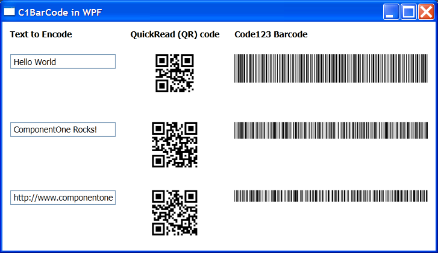

## BarcodeWPF
#### [Download as zip](https://minhaskamal.github.io/DownGit/#/home?url=https://github.com/GrapeCity/ComponentOne-WinForms-Samples/tree/master/NetFramework\Barcode\CS\BarcodeWPF)
____
#### Shows how you can create WPF wrappers for the C1BarCode controls.
____
The sample contains two classes (C1BarCodeElement and C1QRCodeElement) that derive from the standard Image element and wrap the C1BarCode controls used in WinForms.

The C1BarCodeElement and C1QRCodeElement classes are standard WPF elements. They have a Text property that determines the content to encode. This property can be used in binding scenarios as you would expect.

The sample demonstrates this by binding the content of several bar code elements to text box controls:

```
    <TextBox 
        Name="_tb1" Grid.Row="1" VerticalAlignment="Top" Width="140" Margin="10"
        Text="Hello World" />
    <local:C1QRCodeElement
        x:Name="_qr1" Grid.Row="1" Grid.Column="1" Margin="10" Stretch="None" VerticalAlignment="top"
        Text="{Binding ElementName=_tb1, Path=Text}" />
    <local:C1BarCodeElement
        x:Name="_bc1" Grid.Row="1" Grid.Column="2" Margin="10" VerticalAlignment="top"
        Text="{Binding ElementName=_tb1, Path=Text}" />
```

Because of the binding support, the main window in this sample contains no code-behind.



NOTE: To use these barcode elements, applications must have references to the following assemblies:

* C1.Win.C1BarCode.4.dll
* System.Windows.Forms.dll
* Wystem.Drawing.dll

Also, since the C1BarCode is licensed, the application must include a text file called licenses.licx built as an embedded resource. The licenses.licx file should contain the name of the licensed controls and assemblies used:

```
  C1.Win.C1BarCode.C1BarCode, C1.Win.C1BarCode.4
  C1.Win.C1BarCode.C1QRCode, C1.Win.C1BarCode.4
```
