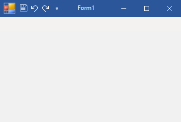

## AddQATItems
#### [Download as zip](https://grapecity.github.io/DownGit/#/home?url=https://github.com/GrapeCity/ComponentOne-WinForms-Samples/tree/master/NetFramework\C1.Win.Ribbon\VB\AddQatItems)
____
#### This sample shows how to add buttons to the Quick Access Toolbar (QAT) from code.
____
This sample utilizes the following classes, methods and properties:

* C1Ribbon;
* C1Ribbon.Qat;
* C1Ribbon.Qat.Items;
* C1Ribbon.Qat.Items.Add(RibbonItem item);
* RibbonButton.

