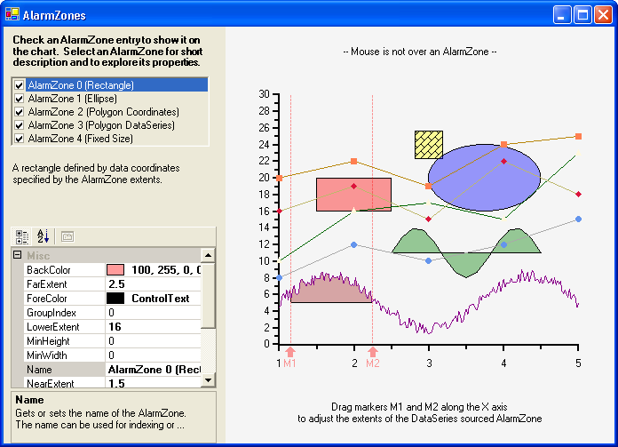

## AlarmZoneShapes
#### [Download as zip](https://grapecity.github.io/DownGit/#/home?url=https://github.com/GrapeCity/ComponentOne-WinForms-Samples/tree/master/NetFramework\Charts\CS\AlarmZoneShapes)
____
#### Shows a an XY chart with various styles of AlarmZones.
____
The sample creates a default XY chart with various types of AlarmZones include rectangles, ellipse and polygons. Also included in the use ValueLabels in Mixed mode, and marker characteristics.

