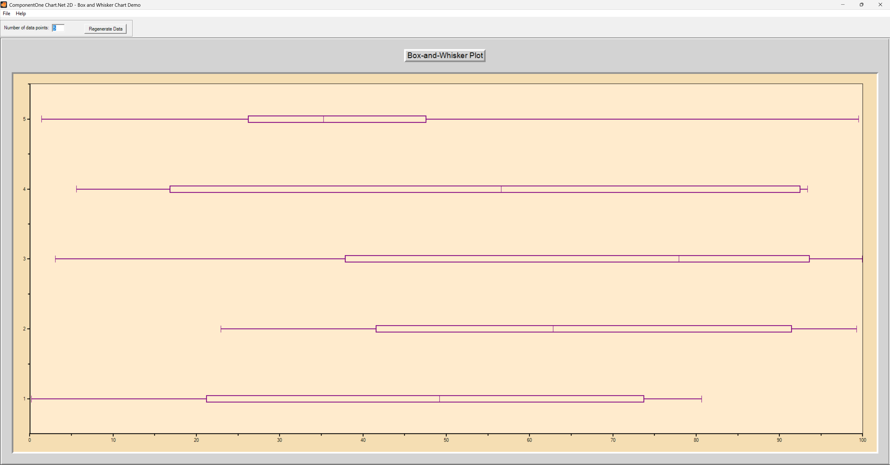

## Box
#### [Download as zip](https://grapecity.github.io/DownGit/#/home?url=https://github.com/GrapeCity/ComponentOne-WinForms-Samples/tree/master/NetFramework\Charts\CS\Box)
____
#### Shows a Box-and-Whisker chart.
____
The sample creates a Box-and-Whisker-Chart using randomly generated data.
Two ChartGroups are used to superimpose horizontal candle chart data with XYPlot data and line symbols to produce the Box-and-Whisker effect.

