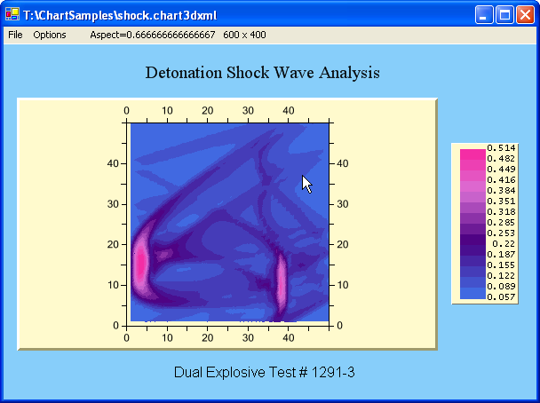

## ChartLoader
#### [Download as zip](https://minhaskamal.github.io/DownGit/#/home?url=https://github.com/GrapeCity/ComponentOne-WinForms-Samples/tree/master/NetFramework\Charts\CS\ChartLoader)
____
#### Loads 2D and 3D charts from saved XML and allows editing and resaving.
____
This sample loads charts saved as XML, and allows them to be edited through various means, including the Chart Properties Dialog, the Chart Wizard Dialog, and a basic Property Grid.

After editing, the chart can be resaved as XML, or chart images can be generated and saved.

Although this sample demonstrates the 2D and 3D chart loading, saving and image generation functions, the sample is also useful as a utility for manipulating chart XML files at runtime and storing the chart state.