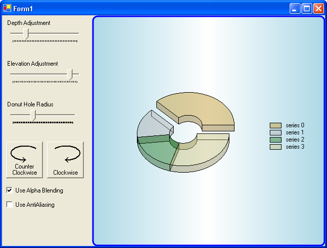

## Donut
#### [Download as zip](https://grapecity.github.io/DownGit/#/home?url=https://github.com/GrapeCity/ComponentOne-WinForms-Samples/tree/master/NetFramework\Charts\CS\Donut)
____
#### Shows a doughnut chart with various functions.
____
The sample creates a doughnut chart and demonstrates the use of tooltips, alpha blending and series highlighting.

A doughnut chart is simply a pie chart with an inner radius specifying the hole size.