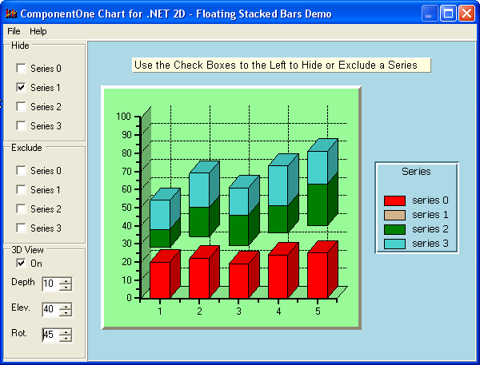

## FloatBar
#### [Download as zip](https://grapecity.github.io/DownGit/#/home?url=https://github.com/GrapeCity/ComponentOne-WinForms-Samples/tree/master/NetFramework\Charts\CS\FloatBar)
____
#### Shows a floating bar chart.
____
The sample creates a stacked bar chart and shows the effect of hiding and excluding series from the stack bars.
A stacked bar chart with one or more lower segments of the stack hidden is known as a floating bar chart.
3D bar chart effects are also demonstrated.

