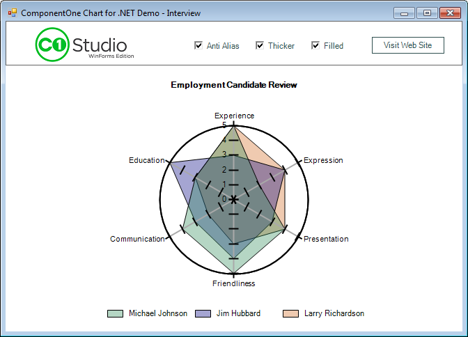

## Interview
#### [Download as zip](https://grapecity.github.io/DownGit/#/home?url=https://github.com/GrapeCity/ComponentOne-WinForms-Samples/tree/master/NetFramework\Charts\CS\Interview)
____
#### Shows a radar chart with various effects.
____
The sample creates radar chart as a method of comparing employment candidates, and demonstrates legend orientation, will alpha blending when a filled radar chart is selected. Also demonstrated are the effects of antialiasing.

