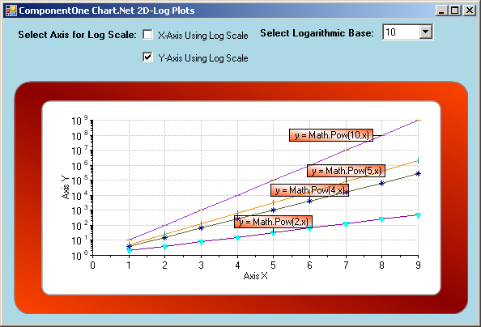

## LogPlots
#### [Download as zip](https://grapecity.github.io/DownGit/#/home?url=https://github.com/GrapeCity/ComponentOne-WinForms-Samples/tree/master/NetFramework\Charts\CS\LogPlots)
____
#### Shows plots of various power series terms with logarithmic axes options.
____
The sample creates a 2D line chart of various power series terms and displays with both logarithmic and linear axis scaling.
Various axis annotation formats are exhibited including one especially useful for log plots.

Automatically positioned labels are used to identify individual series.

