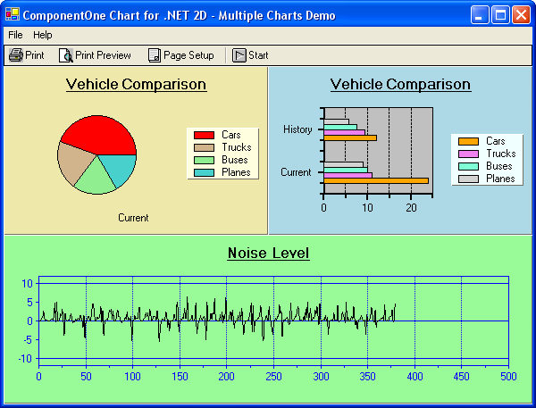

## Multi
#### [Download as zip](https://grapecity.github.io/DownGit/#/home?url=https://github.com/GrapeCity/ComponentOne-WinForms-Samples/tree/master/NetFramework\Charts\CS\Multi)
____
#### Show multiple concurrent charts and print techniques.
____
The sample creates multiple charts on the same form and animates the charts with a timer, demonstrating both effects and speed.
Several print functions are demonstrated, allowing print previews, and placement of multiple charts on a single page using the chart Draw function which 
renders a chart to a specified area of a Graphics object.

