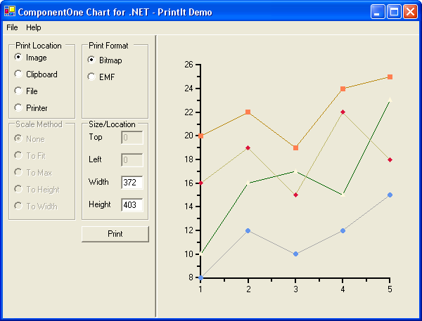

## PrintIt2D
#### [Download as zip](https://grapecity.github.io/DownGit/#/home?url=https://github.com/GrapeCity/ComponentOne-WinForms-Samples/tree/master/NetFramework\Charts\CS\PrintIt2D)
____
#### Loads both 2D and 3D persisted from and generates images or prints them.
____
The sample reads in 2d or 3d persisted charts saved from other chart applications or from the Samples\ChartFiles folder included with the chart.
The sample can then be used to print, print preview, saves images to files and the clipboard. Various scaling methods are demonstrated.

