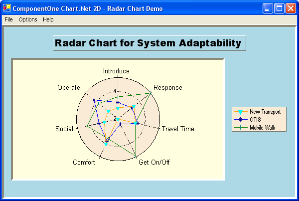

## Radar
#### [Download as zip](https://minhaskamal.github.io/DownGit/#/home?url=https://github.com/GrapeCity/ComponentOne-WinForms-Samples/tree/master/NetFramework\Charts\CS\Radar)
____
#### Shows a radar chart and demonstrates stacked and filled radar options.
____
The sample creates a radar chart and demonstrates the use of value labels, and filled and stacked radar chart options.

