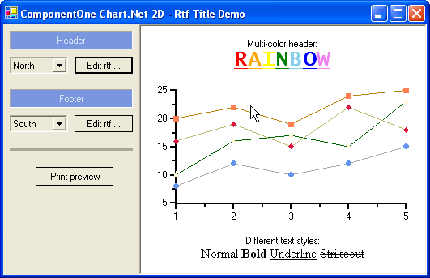

## RtfTitle
#### [Download as zip](https://minhaskamal.github.io/DownGit/#/home?url=https://github.com/GrapeCity/ComponentOne-WinForms-Samples/tree/master/NetFramework\Charts\CS\RtfTitle)
____
#### Shows a simple XYPlot with RTF formatted headers and footers.
____
The sample creates a simple 2D XYPlot, and adds headers and footers with RFT formatting.
A simple RTF editor using a RichTextBox control is part of the sample to allow modifications of the header and footer.

