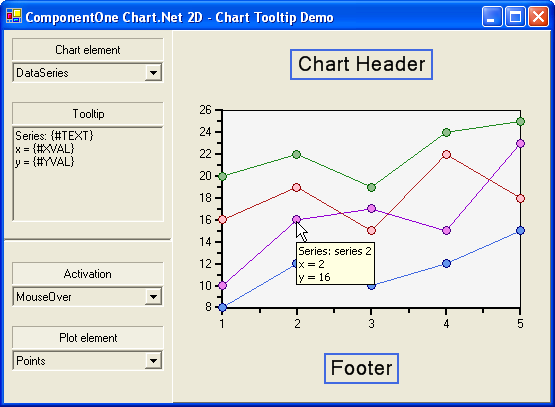

## Tooltip
#### [Download as zip](https://grapecity.github.io/DownGit/#/home?url=https://github.com/GrapeCity/ComponentOne-WinForms-Samples/tree/master/NetFramework\Charts\CS\Tooltip)
____
#### Shows a 2D XYPlot and the use of chart Tooltips.
____
The sample creates a 2D XYPlot chart and demonstrates the use of the chart tooltip functions, properties and events.

