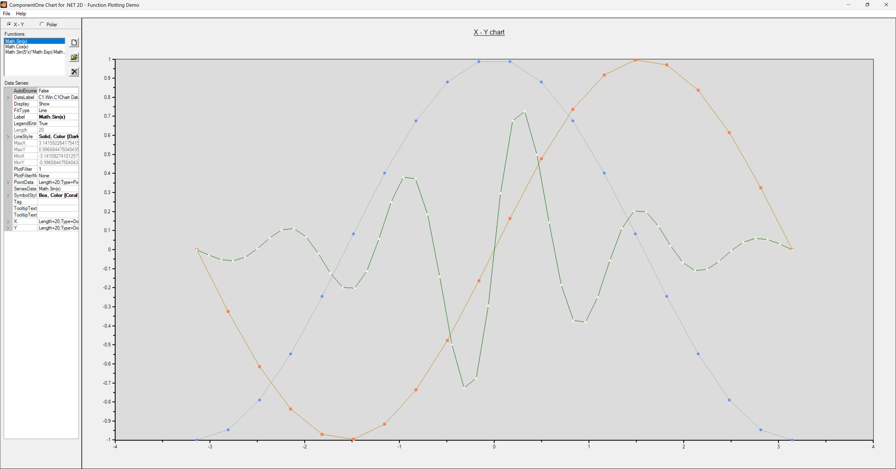

## Function2D
#### [Download as zip](https://minhaskamal.github.io/DownGit/#/home?url=https://github.com/GrapeCity/ComponentOne-WinForms-Samples/tree/master/NetFramework\Charts\CS\function2d)
____
#### Shows XYPlot and Polar charts of specified functions.
____
The sample creates an XYPlot or Polar chart based upon specified functions. The functions include both those given or any input functions that can be specified by a single line of C#.

The sample also demonstrates series data editing through a runtime property grid.