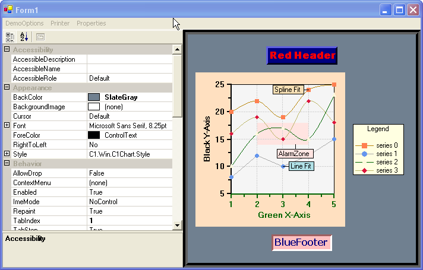

## PropGrid (Demo2D)
#### [Download as zip](https://grapecity.github.io/DownGit/#/home?url=https://github.com/GrapeCity/ComponentOne-WinForms-Samples/tree/master/NetFramework\Charts\CS\propGrid)
____
#### Explores all 2D chart types and their properties.
____
The sample generates all 2D chart types through menu options and allows customization through a property grid control.
The property grid control exposes virtually all objects and properties of the 2D chart.

Additionally, the sample allows 2D charts to be loaded or saved, and chart images to be created or printed. Mouse tracking techniques are also demonstrated.

