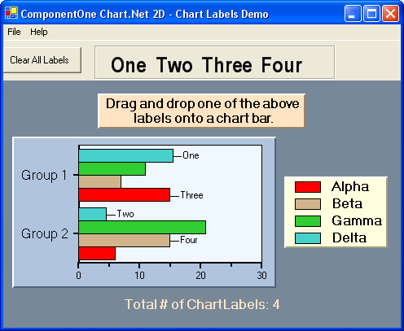

## Chlabels
#### [Download as zip](https://minhaskamal.github.io/DownGit/#/home?url=https://github.com/GrapeCity/ComponentOne-WinForms-Samples/tree/master/NetFramework\Charts\VB\Chlabels)
____
#### Shows a horizontal bar chart with mouse tracking.
____
The sample creates a horizontal bar chart with ChartLabels that are dynamically generated based upon mouse position.
The ChartLabels describe various chart elements and data points.

Additionally, the samples shows how bar values can be changed interactively using the mouse position and buttons.