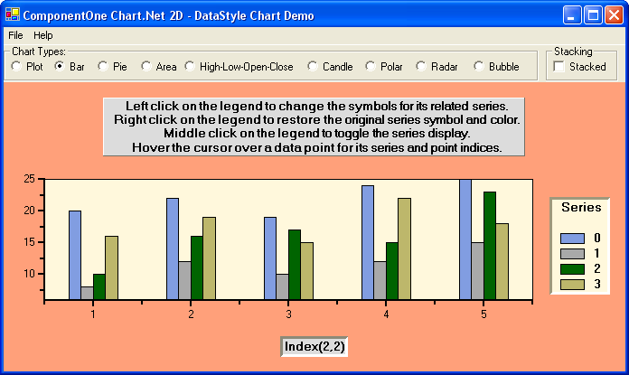

## DataStyl
#### [Download as zip](https://grapecity.github.io/DownGit/#/home?url=https://github.com/GrapeCity/ComponentOne-WinForms-Samples/tree/master/NetFramework\Charts\VB\DataStyl)
____
#### Shows various 2D charts and allows interactive variance of style.
____
The sample creates various 2d charts by radio button selection and demonstrates mouse tracking for each type of chart, for both the data points and the legend.

Types of charts include XYPlot, Bar, Pie, Area, High-Low-Open-Close, Candle, Polar, Radar, and Bubble. Stacking is demonstrated for appropriate chart types.

