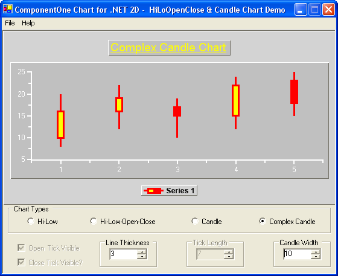

## HLCandle
#### [Download as zip](https://minhaskamal.github.io/DownGit/#/home?url=https://github.com/GrapeCity/ComponentOne-WinForms-Samples/tree/master/NetFramework\Charts\VB\HLCandle)
____
#### Show various price/stock charts.
____
The sample creates various types of price charts, including High-Low, High-Low-Open-Close, Candle and Complex Candle charts.

Various options associated with each kind of chart is demonstrated.