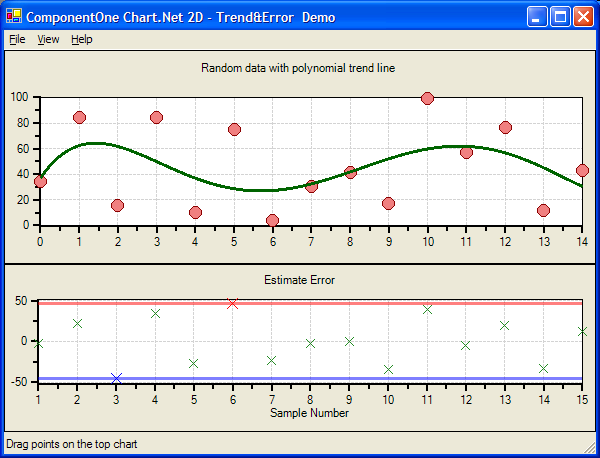

## TrendAndError
#### [Download as zip](https://minhaskamal.github.io/DownGit/#/home?url=https://github.com/GrapeCity/ComponentOne-WinForms-Samples/tree/master/NetFramework\Charts\VB\TrendAndError)
____
#### Shows two chart with different trend lines.
____
The sample creates two charts. 
The top chart represents random data with a polynomial trend line. The order of polynomial can be changed using a menu, and the data points on the chart can be moved using the mouse.
The second, bottom chart shows regression errors for each point on the first chart, and two trend lines on the bottom chart show the maximum positive and negative errors.

