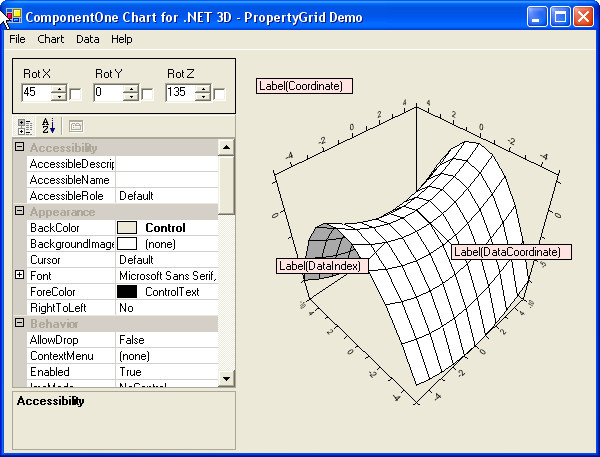

## PropGrid3D (Demo3D)
#### [Download as zip](https://grapecity.github.io/DownGit/#/home?url=https://github.com/GrapeCity/ComponentOne-WinForms-Samples/tree/master/NetFramework\Charts\VB\propGrid3D)
____
#### Shows various 3D charts and explores their properties.
____
The sample creates a 3D chart and allows various rotation settings through form controls or changes of virtually any chart property through a property grid.

Charts may be persisted or loaded through menu options, as well as chart data sets.