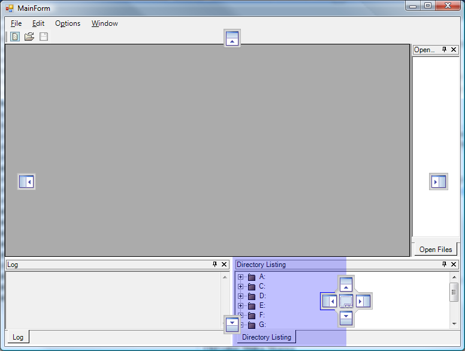

## MdiTabs
#### [Download as zip](https://minhaskamal.github.io/DownGit/#/home?url=https://github.com/GrapeCity/ComponentOne-WinForms-Samples/tree/master/NetFramework\Command\CS\MdiTabs)
____
#### Shows how to use C1DockingTab to create a Visual Studio-like multiple window environment.
____
This sample shows how to use C1DockingTab to create a multiple-window, Visual Studio-like editing environment, with a set of editor windows, a side and a bottom panels.

The sample also allows to switch DockingStyle from VS2005 to Default.