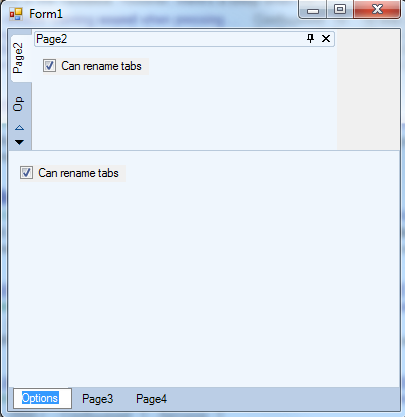

## RenamingTabs
#### [Download as zip](https://grapecity.github.io/DownGit/#/home?url=https://github.com/GrapeCity/ComponentOne-WinForms-Samples/tree/master/NetFramework\Command\CS\RenamingTabs)
____
#### Demonstrates renaming tabs feature.
____
Use C1DockingTab.CanRenameTabs property to allow renaming tabs on mouse double click at runtime.

