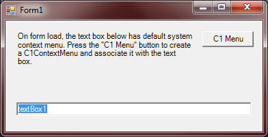

## CreateMenusInCode
#### [Download as zip](https://minhaskamal.github.io/DownGit/#/home?url=https://github.com/GrapeCity/ComponentOne-WinForms-Samples/tree/master/NetFramework\Command\VB\CreateMenusInCode)
____
#### Shows how to create and wire up context menus in code.
____
Creates a C1ContextMenu for a text box completely in code, on a form that does not have any other C1Command elements. Wires up click event handlers for the menu items. Also sets up state query handlers for the commands so that their state (enabled etc.) is kept up to date automatically by C1Command.

