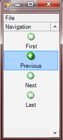

## ProgramOutBar
#### [Download as zip](https://grapecity.github.io/DownGit/#/home?url=https://github.com/GrapeCity/ComponentOne-WinForms-Samples/tree/master/NetFramework\Command\VB\ProgramOutBar)
____
#### Shows how to add toolbars to a C1OutBar in code
____
The sample starts with a form containing a C1OutBar with two empty pages (created at design time).
The form also contains an empty command holder.
In the form load handler, a bunch of commands is crated on the command holder.
Two toolbars are also created and filled with links to the commands. The toolbars are placed on the outbar pages.

