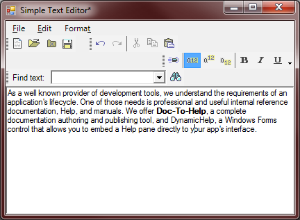

## SimpleTextEditor2
#### [Download as zip](https://minhaskamal.github.io/DownGit/#/home?url=https://github.com/GrapeCity/ComponentOne-WinForms-Samples/tree/master/NetFramework\Command\VB\SimpleTextEditor2)
____
#### Shows how to add an arbitrary control to a toolbar item.
____
This sample is similar to SimpleTextEditor, but additionally includes a combo box nested in a movable and dockable C1ToolBar, implementing a simple text search.

