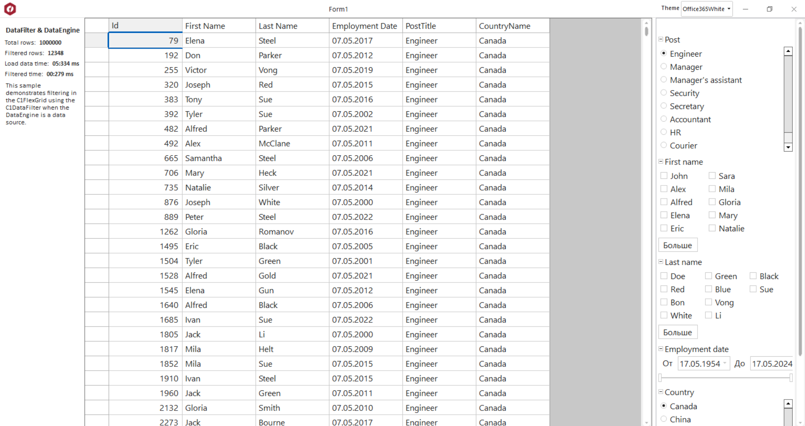

## DataFilterAndDataEngine
#### [Download as zip](https://grapecity.github.io/DownGit/#/home?url=https://github.com/GrapeCity/ComponentOne-WinForms-Samples/tree/master/NetFramework\DataFilter\CS\DataFilterAndDataEngine)
____
#### Shows how to using C1DataEngine as a data source of DataFilter
____
The sample demonstrates how to filtering in the C1FlexGrid using the C1DataFilter when the C1DataEngine is a data source.

