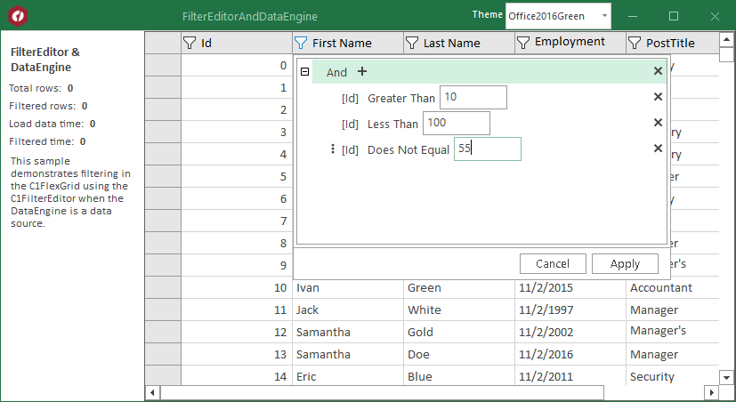

## FilterEditorAndDataEngine
#### [Download as zip](https://grapecity.github.io/DownGit/#/home?url=https://github.com/GrapeCity/ComponentOne-WinForms-Samples/tree/master/NetFramework\DataFilter\CS\FilterEditorAndDataEngine)
____
#### FilterEditor and DataEngine
____
Shows how to filtering in the C1FlexGrid using the C1FilterEditor when the DataEngine is a data source.

