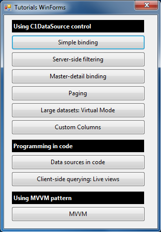

## Tutorials
#### [Download as zip](https://minhaskamal.github.io/DownGit/#/home?url=https://github.com/GrapeCity/ComponentOne-WinForms-Samples/tree/master/NetFramework\DataSource\CS\TutorialsWinForms-ObjectContext)
____
#### C1DataSource Tutorials for WinForms and standard DataGridView
____
This project uses the standard Microsoft DataGridView control and the legacy ObjectContext.

A version of the same tutorials using the newer (and default) Entity Framework DbContext can be found in the **TutorialsWinForms** folder.
A version of the same tutorials using ComponentOne C1FlexGrid control (for WinForms) can be found in the **TutorialsWinForms-C1FlexGrid** folder.
