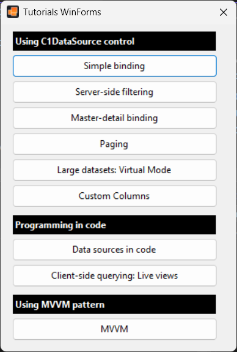

## Tutorials for WinForms
#### [Download as zip](https://minhaskamal.github.io/DownGit/#/home?url=https://github.com/GrapeCity/ComponentOne-WinForms-Samples/tree/master/NetFramework\DataSource\CS\TutorialsWinForms)
____
#### C1DataSource Tutorials using WinForms and standard DataGridView
____
This project uses the standard Microsoft DataGridView control.

A version of the same tutorials using ComponentOne C1FlexGrid control (for WinForms) can be found in the **TutorialsWinForms-C1FlexGrid** folder.
