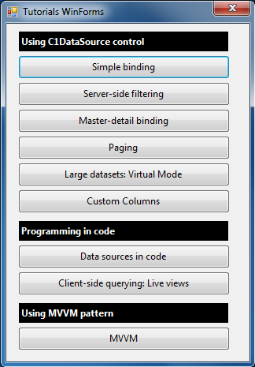

## Tutorials for WinForms
#### [Download as zip](https://grapecity.github.io/DownGit/#/home?url=https://github.com/GrapeCity/ComponentOne-WinForms-Samples/tree/master/NetFramework\DataSource\CS\TutorialsWinFormsC1FlexGrid)
____
#### C1DataSource Tutorials using WinForms and C1FlexGrid.
____
This project uses C1FlexGrid for WinForms.
A version of the same tutorials using the standard Microsoft DataGridView control can be found in the folder TutorialsWinForms.

