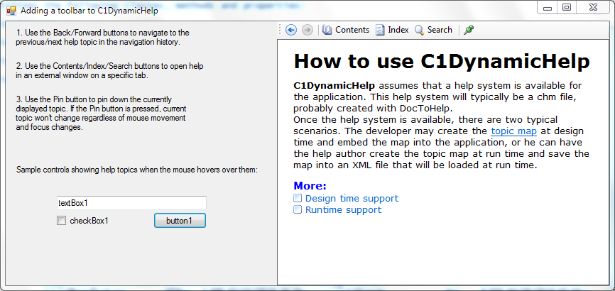

## AddingUICommands
#### [Download as zip](https://grapecity.github.io/DownGit/#/home?url=https://github.com/GrapeCity/ComponentOne-WinForms-Samples/tree/master/NetFramework\DynamicHelp\CS\AddingUICommands)
____
#### Adding a toolbar for pinning down current topic, navigating through topics and opening external help.
____
C1DynamicHelp does not have any built-in GUI except for the control displaying help topics. But you can use any GUI that you need to interact with C1DynamicHelp.
This sample demonstrates how to create a toolbar with common commands.

This sample utilizes the following classes, methods and properties:

* C1DynamicHelp.Browser
* C1DynamicHelp.ShowExternalHelp(C1.Win.C1DynamicHelp.HelpTab tab)
* C1DynamicHelp.ShowExternalHelp(C1.Win.C1DynamicHelp.HelpTab tab, object parameter)
* C1DynamicHelp.IsPinnedDown
