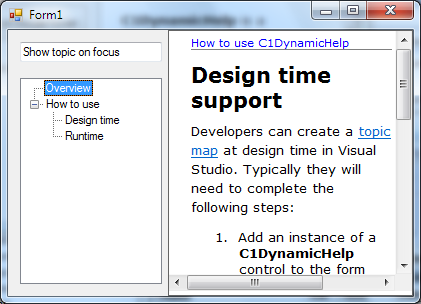

## Tutorial2
#### [Download as zip](https://grapecity.github.io/DownGit/#/home?url=https://github.com/GrapeCity/ComponentOne-WinForms-Samples/tree/master/NetFramework\DynamicHelp\CS\Tutorials\Tutorial2)
____
#### Mapping Help Topics in Authoring Mode
____
This tutorial shows the second method of assigning Help topics to controls on a form.
It is done entirely by Help authors; once a software developer sets up his application to use the C1DynamicHelp authoring mode, he doesn't need to do anything to map topics to controls.
This eliminates the error-prone process of passing the topic/control map back and forth between Help authors and software developers.

This tutorial describes how to perform the following actions:

* Add C1DynamicHelp to the Windows form
* Set up the C1DynamicHelp control to be used in authoring mode
* Activate/deactivate authoring mode
* Associate topics to controls on a form in authoring mode
* Save changes in the topic map
