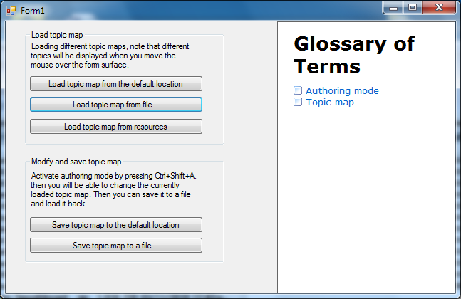

## WorkingWithTopicMap
#### [Download as zip](https://grapecity.github.io/DownGit/#/home?url=https://github.com/GrapeCity/ComponentOne-WinForms-Samples/tree/master/NetFramework\DynamicHelp\CS\WorkingWithTopicMap)
____
#### Saving and loading topic map.
____
This sample demonstrates several ways of storing topic maps. They can be saved in XML files or in application resources.
After that you can load any topic map from these locations whenever you need it.

The sample also shows how to activate/deactivate Authoring Mode to edit a topic map.
When Authoring Mode is activated, you can associate any control on a form with a topic in the help file.

This sample utilizes the following classes, methods and properties:

* C1DynamicHelp.TopicMap
* C1DynamicHelp.TopicMap.Refresh()
* C1DynamicHelp.AuthoringMode
* C1DynamicHelp.TopicMap.Load()
* C1DynamicHelp.TopicMap.Load(string fileName)
* C1DynamicHelp.TopicMap.Save()
* C1DynamicHelp.TopicMap.Save(string fileName)
* C1DynamicHelp.TopicMap.XmlSource

