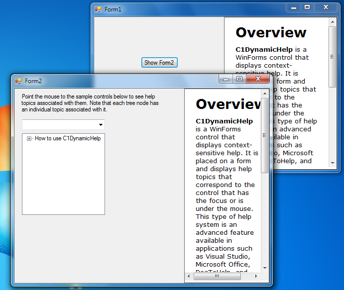

## MultipleForms
#### [Download as zip](https://grapecity.github.io/DownGit/#/home?url=https://github.com/GrapeCity/ComponentOne-WinForms-Samples/tree/master/NetFramework\DynamicHelp\VB\MultipleForms)
____
#### Using C1DynamicHelp controls on multiple forms with a single help source.
____
The sample demonstrates how to set up C1DynamicHelp controls on multiple forms that use a help file and a topic map file common for all forms.

This sample utilizes the following classes, methods, events and properties:

* C1DynamicHelp.TopicMap.Refresh()
* C1DynamicHelp.TopicMap.TopicMapChanged
* C1DynamicHelp.TopicMap.TopicMapSaved
* C1DynamicHelp.MainControl
* C1DynamicHelp.AuthoringMode

