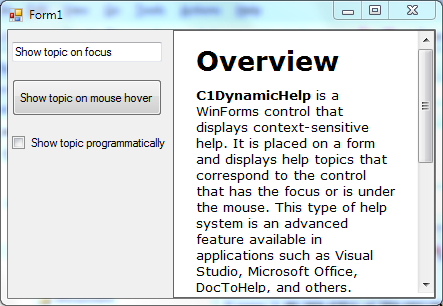

## Tutorial1
#### [Download as zip](https://grapecity.github.io/DownGit/#/home?url=https://github.com/GrapeCity/ComponentOne-WinForms-Samples/tree/master/NetFramework\DynamicHelp\VB\Tutorials\Tutorial1)
____
#### Mapping Help Topics at Design Time.
____
This tutorial explains how to use C1DynamicHelp to map Help topics to controls on a form at design time within Visual Studio.
This is usually done by a software developer.

This tutorial describes how to perform the following actions:

* Add C1DynamicHelp to the Windows form
* Set up the C1DynamicHelp control
* Associate topics with controls on the form at design-time
* Associate a topic with the form at design-time
* Show topics programmatically

