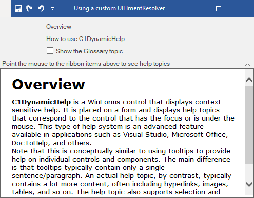

## UsingUIElementResolver
#### [Download as zip](https://minhaskamal.github.io/DownGit/#/home?url=https://github.com/GrapeCity/ComponentOne-WinForms-Samples/tree/master/NetFramework\DynamicHelp\VB\UsingUIElementResolver)
____
#### Using a custom UIElementResolver to handle custom third-party controls in C1DynamicHelp.
____
The sample demonstrates how C1DynamicHelp can be used with controls (or their parts) that are not inherited from the **System.Windows.Forms.Control** class.
This sample shows how to create a custom **UIElementResolver** for the **C1Ribbon** control, so C1DynamicHelp can be used with the C1Ribbon.

NOTE: You need to have the C1Ribbon control installed on your machine in order to run this sample.

This sample utilizes the following classes, methods, events and properties:

* C1DynamicHelp.AuthoringMode
* C1DynamicHelp.Resolver
* C1DynamicHelp.UIElementResolver
* C1DynamicHelp.UIElementResolver.ActivateUIElement(object uiElement)
* C1DynamicHelp.UIElementResolver.FindUIElement(object parent, string name)
* C1DynamicHelp.UIElementResolver.GetUIElementAtPoint(object parent, System.Drawing.Point pt)
* C1DynamicHelp.UIElementResolver.GetUIElementInfo(object uiElement)
